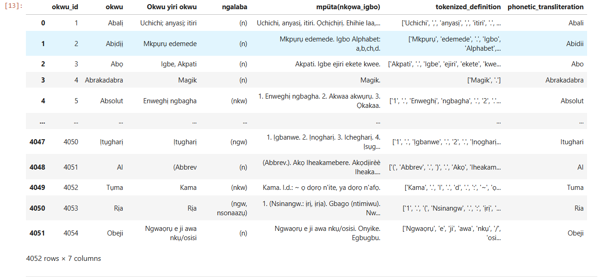

# Glossary-Generator-for-igbo-Language
This project builds a machine learning model for generating Igbo word explanations using transformer-based NLP architectures (T5).  It supports training with PyTorch or TensorFlow and is tailored to empower natural language understanding in low-resource African languages.

# Team Members

Odirichukwu, Jacinta Chioma, PhD.
Senior Lecturer.
Department of Computer Science,
School of Information and Communication Technology,
Federal University of Technology Owerri, Imo State Nigeria.
+2348037394691
jacinta.odirichukwu@futo.edu.ng

Reginald Nnadozie Nnamdi (PhD)
Department of Philosophy
Veritas University Abuja,
FCT, Nigeria,
reginaldnnamdi5@gmail.com

Simon Peter Chimaobi Odirichukwu
Department of Health,
Primary Health Development Agency, Owerri,
Imo State, Nigeria
sodirichukwu@gmail.com

# Introduction
Over 30 million people worldwide speak Igbo language, and the Igbo language is predominantly spoken by Igbo people in South-Eastern Nigeria (Odirichukwu and Nnamdi, 2023)

# Problem Statement
Unlike other low-resource African languages, Igbo language faces the same challenge of inadequate or in most cases complete lack of resources dataset and methods which supports the research and development of even basic NLP tools for well over 30 million users.

# Objectives

1. To Loads a dataset of Igbo words, their meanings, and related tokens.
2. Cleans the dataset to ensure all fields are usable.
3. Prepares a list of dictionary samples in this format:

  {
    "input_text": "translate Igbo to explanation: abalị uchichi anyasị itiri",
    "target_text": "Ọchịchịrị. Ehihie laa, chi ejiela."
  }

# Project Highlights

Igbo-to-Igbo text generation using contextual tokens
Cleaned and structured dataset for low-resource language modeling
Fine-tuned HuggingFace `t5-small` transformer model
Supports both PyTorch (Trainer) and TensorFlow (Keras) backends
Optimized input formatting: Igbo word + context ➝ explanation
Includes preprocessing, training, and inference scripts
 Ideal for language researchers, data scientists, and lexicon developers
 Project Structure

├── data/cleaned_igbo_dataset.csv         # Final training dataset  
├── gloss_generator_pytorch.py            # Fine-tune T5 with PyTorch Trainer  
├── gloss_generator_tensorflow.py         # Fine-tune T5 with TensorFlow model.fit  
├── preprocess.py                         # Generate input_text and target_text  
├── inference.py                          # Predict explanations using trained model  
├── igbo_gloss_model/                     # Saved PyTorch model and tokenizer  
├── igbo_gloss_model_tf/                  # Saved TensorFlow model and tokenizer  
├── README.md                             # Documentation for GitHub  

 Dataset

Each row in the training data contains:
- `okwu`: Igbo headword
- `cleaned_tokens`: list of semantically related tokens (e.g. synonyms, dialect forms)
- `mpüta`: Igbo explanation or gloss

The training script formats input as:  
**translate Igbo to explanation: okwu cleaned_tokens ➝ mpüta**

🧪 Model Training

PyTorch Training:
- Fine-tuned using HuggingFace `Trainer`
- `T5ForConditionalGeneration` + `T5Tokenizer`
- 5 epochs, max_length 64, batch size 8

TensorFlow Training:
- Uses `TFT5ForConditionalGeneration` and `model.fit()`
- Tokenized input/output with padding and truncation

📥 Inference Example

def generate_igbo_gloss(word, tokens):

    input_text = f"translate Igbo to explanation: {word} {' '.join(tokens)}"

    input_ids = tokenizer.encode(input_text, return_tensors='pt')

    output = model.generate(input_ids, max_length=64)

    return tokenizer.decode(output[0], skip_special_tokens=True)

🌍 Use Cases

- Digital Igbo Dictionary Projects
- Lexicography and Linguistics Research
- Language Learning Apps
- Machine Translation Gloss Generation

💼 Portfolio Impact

This project demonstrates ability to:
- Solve NLP problems in underrepresented languages
- Handle noisy linguistic data (token lists, glosses)
- Fine-tune modern transformers using clean supervision
- Adapt ML tools for educational, research, or production use
- Publish code with scalable and documented workflow

# Methodology

## PyTorch Implementation with HuggingFace Trainer

## TensorFlow Implementation (Keras-style)

# Results

# Reference
J. C. Odirichukwu and R. N. , Nnamdi, (2023) “Web-based igbo thesaurus
with real-time retrieval.